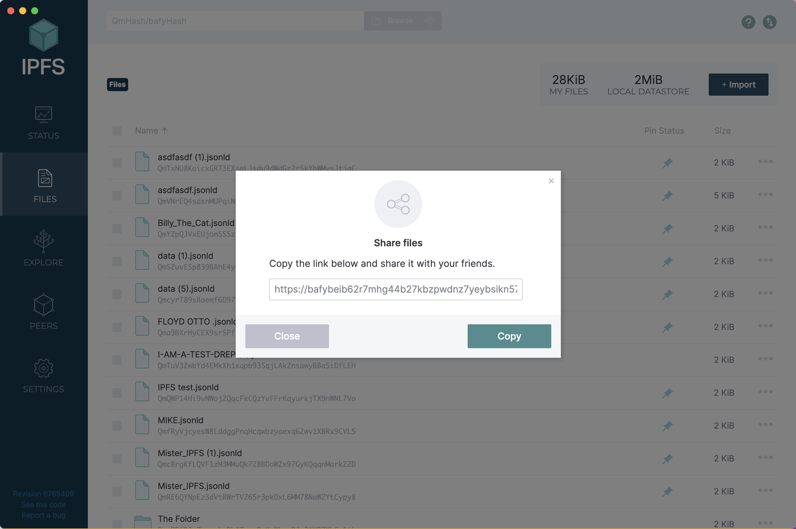

# Propose a Governance Action

To be able to submit a proposal for Governance Action, you will need to connect your wallet to GovTool in order to verify your identity.&#x20;

Please follow the step by step guideline

1. Navigate to [https://gov.tools/](https://gov.tools/)
2. Click "Connect to Propose"

<figure><figcaption></figcaption></figure>

3. Click "Proposals"

<figure><figcaption></figcaption></figure>

4. Click "Verify your identity"

<figure><figcaption></figcaption></figure>

5. Select your wallet and connect.
6. Click "Propose a Governance Action"

<figure><figcaption></figcaption></figure>

7. Click "Create new Proposal"

<figure><figcaption></figcaption></figure>

8. Please ensure that you fill in all the required fields. It is important to complete every mandatory section to proceed successfully.

<figure><figcaption></figcaption></figure>

9. Once you have filled in all the required fields, please click "Continue" to proceed to the next step.

<figure><figcaption></figcaption></figure>

10. Then click on "Submit"

<figure><figcaption></figcaption></figure>

10. Before submitting the proposal as a Governance Action, it is recommended to add a poll as a temperature check. To do this, click on "Add a poll."

<figure><figcaption></figcaption></figure>

11. After the poll has closed, you can submit the proposal as a Governance Action.
