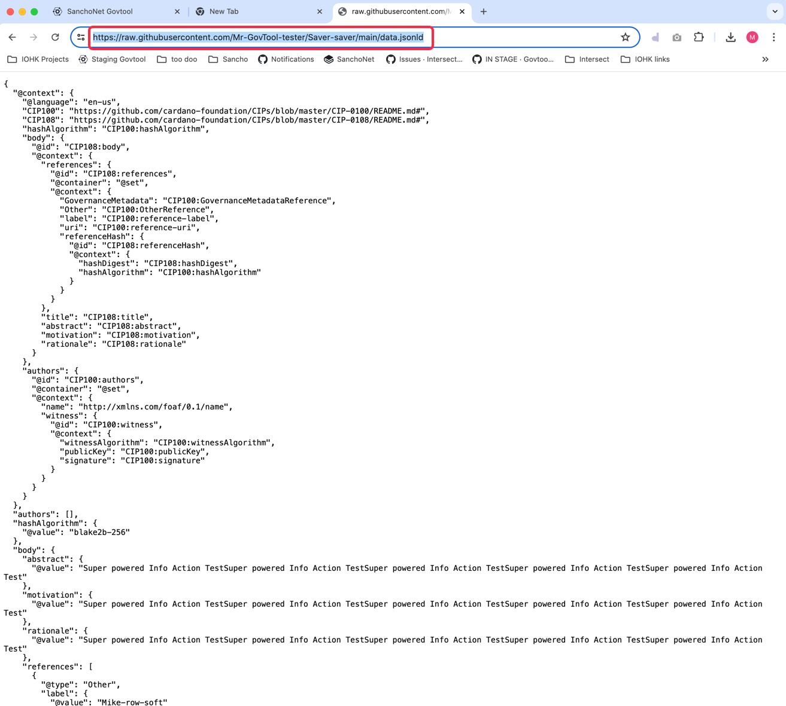

# Storing Information offline

Generally speaking, most data in Governance is stored off-chain, and is referenced by an on-chain url and hash. For more detailed information, please see [CIP-1694](https://www.1694.io/en)

Off-chain data can be stored in many places, such as IPFS, a web URL, or repo site like GitHub. The URL that references the data has to be publicly readable.

Here is an example of using GitHub for storing data for a Governance Action. Storing data for becoming a DRep is the same process.

1.  Agree to store information and click "Continue\

    <figure><figcaption></figcaption></figure>
2.  Your information will be packaged up in a .jsonld file. Click on the button with the filename in it, and save it to your computer.\

    <figure><figcaption></figcaption></figure>
3.  If you don't have a github account, you will need to create one. Simply enter your email address and click "Sign up for GitHub.\

    <figure><figcaption></figcaption></figure>
4.  Click "Continue\

    <figure><figcaption></figcaption></figure>
5.  Create a password, click "Continue"\

    <figure><figcaption></figcaption></figure>
6.  Create a github user name (must be unique on github).\

    <figure><figcaption></figcaption></figure>
7.  GitHub will send you a confirmation code to your email inbox. Find it and enter it here.\

    <figure><figcaption></figcaption></figure>
8. You now have a new GitHub account. You must create a repository, so in the screen below:&#x20;
   1. Create a name for your repository
   2. Make your repository public
   3.  Click "Create Repository"\

       <figure><figcaption></figcaption></figure>
9.  Now you have a public GitHub repository of your own!. In the example below, the repository is called "Saver-saver". You will need to upload the data.jsonld file that you got from GovTool now. Click the link "uploading an existing file"\

    <figure><figcaption></figcaption></figure>
10. Upload the "data.jsonld" file to GitHub by drag-and-dropping it or choosing it from your computer. Click the "Commit changes" button. This will add your file to GitHub and put it in your repository.\

    <figure><figcaption></figcaption></figure>
11. After the file uploads, you will see it's name in the list below. Click on the file name (it is a link)\

    <figure><figcaption></figcaption></figure>
12. This will display the file contents. You now need to get a URL to paste into GovTool. To do this, click the "Raw" button above the code.\

    <figure><figcaption></figcaption></figure>
13. From the "Raw" view, copy out the URL in the address bar:\

    <figure><figcaption></figcaption></figure>
14. Return to GovTool, paste the URL into the URL field, and click "Submit"\

    <figure><figcaption></figcaption></figure>
15. You have now submitted your data. It may take a few minutes or seconds for GovTool to process it.
