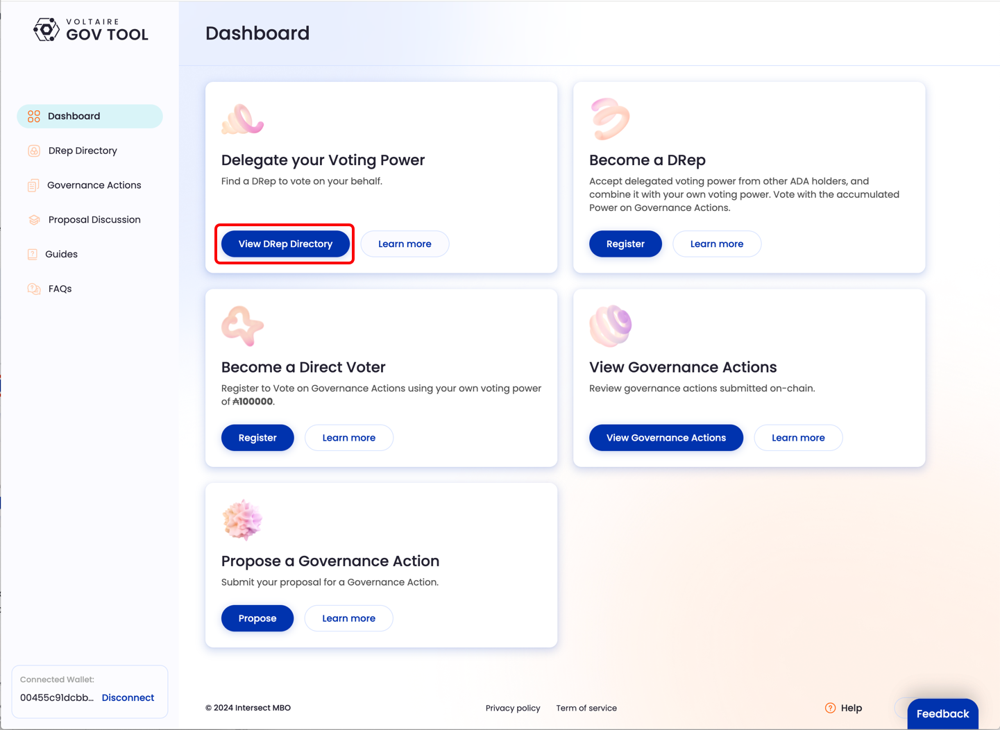
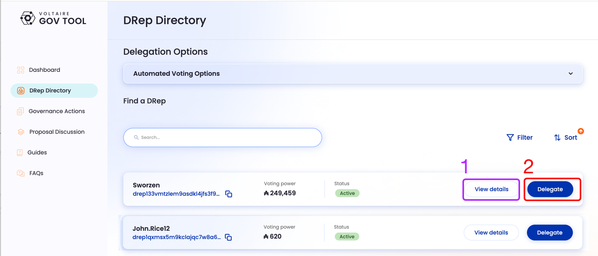

# Delegate to a DRep

1.  **Dashboard**\
    From the dashboard, click the “View DRep Directory” button in the “Delegate your Voting Power” panel.\

    <figure><figcaption></figcaption></figure>
2.  **Delegation Flow**\
    In the next screen you have two options for delegation: You can delegate directly by clicking "Delegate" (2) below, or you can see more details of the DRep by clicking "View Details" (1). If you choose "View Details", you will be able to delegate as well from the subsequent page.\

    
<figure><figcaption></figcaption></figure>

3.  **Wallet Confirmation**\
    Your will be need to sign the transaction in your wallet.\

    
<figure><figcaption></figcaption></figure>

4.  **Trasaction in progress**\
    There will be a short wait while the tranaction gets onto the blockchain\

    
<figure><figcaption></figcaption></figure>

5.  **Delegation Complete**\
    Once the transaction it's completed, the dashboard will show that you have delegated your Voting Power to a DRep.

    In the screen below, you can see that you have delegated your Voting Power and also the name and DRep ID that you've delegated to.&#x20;

    You can change your delegation to another DRep, or to vote "Abstain" or No on all votes by clicking "Delegate to Another DRep".\

    
<figure><figcaption></figcaption></figure>

