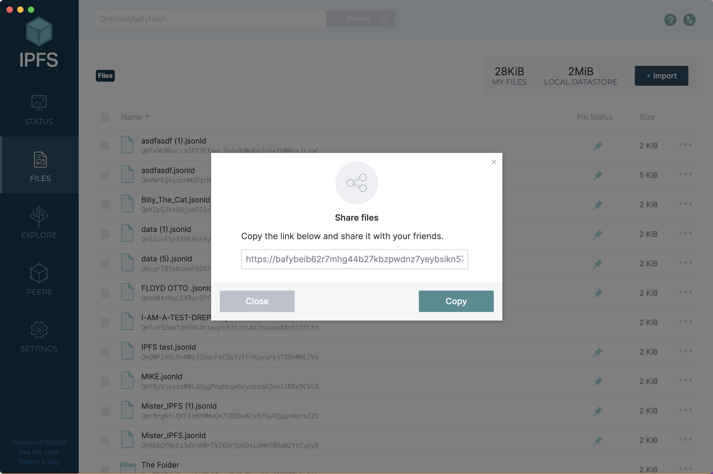

# Register as a DRep

1.  **Dashboard**\
    From the dashboard, click "Register" in the "Become a DRep" panel:\

    
<figure><figcaption></figcaption></figure>

2.  **Roles and Responsibilites**\
    Explains what a DRep does, and tells you about the refundable deposit. \

    
<figure><figcaption></figcaption></figure>

3.  **DRep Info**\
    The DRep name is required, and there are three other fields that are optional: Email, Bio, and Link(s). You can add up to 8 links. This information will be displayed you your DRep page, and publicly available to all users of GovTool\

    
<figure><figcaption></figcaption></figure>

4.  **Data storage confirmation**\
    DRep data is not stored on-chain. Every DRep must responsibly store their information off-chain and pass that link back to GovTool (on the following screen). You must check the box and agree to this to proceed with registration.\

    
<figure><figcaption></figcaption></figure>

5. **Storing your information**\
   There are three steps to storing your information:
   1. Download the file to your computer. This file contains the DRep registration info that you entered in the registration form.
   2. Save the file in a location that will provide you with a publicly-accessible URL.
   3. Copy the URL from the location above and paste it into the URL field.
6.  **Example using GitHub** [**See example using IPFS**](register-as-a-drep.md#ipfs)\
    \
    This example uses a new public repo for simplicity.&#x20;

    1. Upload the file you downloaded in the step above to GitHub&#x20;
    2. Commit the changes to the repository with the green button at the bottom right

    <figure><figcaption></figcaption></figure>
7.  **In GitHub, find the file you uploaded, click on it's name.**\

    <figure><figcaption></figcaption></figure>
8.  **In Code view, click on the "Raw" button**\
    This will take you to the 'Raw' view where you can copy the URL for the code&#x20;

    <figure><figcaption></figcaption></figure>
9.  **In the Raw view, click on the URL in the top bar and copy it**

    <figure><figcaption></figcaption></figure>
10. **Return to GovTool and paste in the URL** \
    Then click "Submit"\

    <figure><figcaption></figcaption></figure>
11. **Sign the transaction in your wallet**\
    &#x20;

    <figure><figcaption></figcaption></figure>
12. **Your transaction will be submitted to the blockchain** \

    <figure><figcaption></figcaption></figure>
13. **Now you are registered as a DRep**\

    <figure><figcaption></figcaption></figure>

#### Store data using IPFS 

One of the simplest ways to store data using IPFS is by using the IPFS desktop app. You can download it here: [https://docs.ipfs.tech/install/ipfs-desktop/](https://docs.ipfs.tech/install/ipfs-desktop/)

<figure><figcaption>
IPFS Download page
</figcaption></figure>

Choose your platform and download and install the desktop app on your computer.

Upload the .jsonld file you from GovTool to IPFS by using the "Import > File" option on the top right of the screen

<figure><figcaption></figcaption></figure>

Once the file is uploaded, you need to set it's 'pinning'. Select the file in the list, click on the three dots at the far right of the screen, and choose "Set Pinning"

<figure><figcaption></figcaption></figure>

Click the "Local Node" checkbox and then the "Apply" button

<figure><figcaption></figcaption></figure>

You will now see the Files list again. Click the three dots again, and choose "Share Link"

<figure><figcaption></figcaption></figure>

Click "Copy" to copy the link

<figure><figcaption></figcaption></figure>

Paste it back into GovTool and click "Submit"

<figure><figcaption></figcaption></figure>

Sign the transaction with your wallet:

<figure><figcaption></figcaption></figure>

Your transaction will be checked and submitted:

<figure><figcaption></figcaption></figure>

You can return to the dashboard, and when the transaction is submitted, you will see your DRep registration there.

<figure><figcaption></figcaption></figure>

You are now registered and can vote as a DRep and also accept delegated voting power from others.
