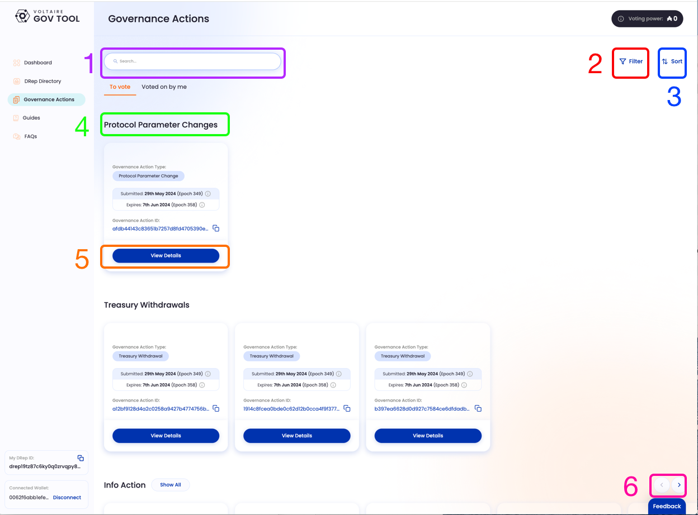
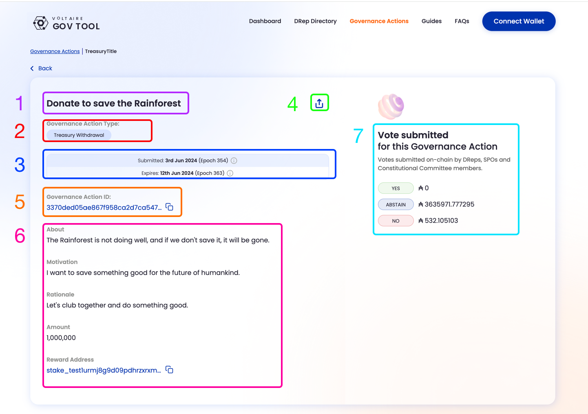

# View Governance Actions

## Starting from the Landing Page

Click "Governance Actions" from the top menu.

<figure><figcaption></figcaption></figure>

## The Governance Actions Page

Clicking on the outlined menu item above will bring you to the Governance Actions page:

1. Search box, enter any Governance Action ID, title, keyword, etc.
2. Filters for Governance Actions. You will be able to choose which categories of Actions you want to see.&#x20;
3. Sort order. Clicking this will allow you to sort Governance Actions by date, and by most votes
4. Categories of Governance Actions. These are the major, pre-set categories of Actions.
5. "View Details" Click on this to see detailed info.
6. Horizontal navigation. Click the left or right arrows to see more proposals.

<figure><figcaption>
Governance Actions page
</figcaption></figure>

## The Governance Action detail page

If you Click on "View Details", you will be taken to a detail screen for that particular proposal

1. Title
2. Governance Action type
3. Submitted and Expiry dates and epochs
4. Share button
5. Governance Action ID
6. Governance Action details
7. Vote tally

<figure><figcaption>
Governance Action detail page
</figcaption></figure>
