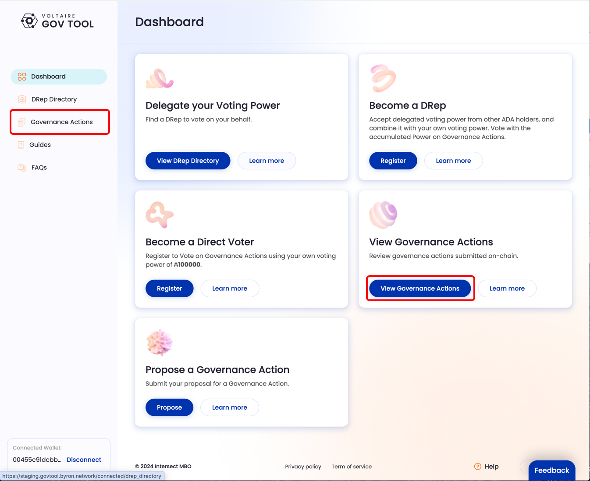

# Governance Actions How to Vote

To be able to vote, you will need to connect your wallet to GovTool, and register yourself as a DRep or a Direct Voter. Once you've done this, the dashboard will change to give you the option to view and vote on Governance Actions.

1.  **Dashboard** Click on the "View and vote" button to see on-chain Governance Actions. _(You can also use the 'Governance actions' tab in sidebar)_\

    <figure><figcaption></figcaption></figure>
2.  **Governance Actions Page**

    1. Search box, type any text Governance Action ID
    2. Links to sort actions that you have not voted on as of yet ("To Vote"), and ones that you have voted on ("Voted")
    3. Main Categories of Governance Actions
    4. Filters and Sort
    5. GA Summary
    6. Click "View Details and Vote" to see proposal, and vote

    

    <figure><figcaption></figcaption></figure>

    

3.  **Governance Action Detail Page**

    1. Title of the Governance Action
    2. Type of the Governance Action
    3. The submission and expiry dates an epochs
    4. Governance Action ID
    5. Governance Action description
    6. Share button
    7. Voting buttons
    8. "Show Votes" will show you the latest votes on this Action
    9. "Provide context about your vote" lets you provide off-chain rationalisation about your vote. You will have to take responsibilty for storing this data yourself.

    **Governance Action Detail Page** This is where you can see all the details of any Governance Action.

    \

    <figure><figcaption></figcaption></figure>
4.  **Voting**\
    Choose "Yes", "No", or "Abstain"&#x20;

    <figure><figcaption></figcaption></figure>
5.  **Wallet Confirmation** \
    You will be asked to sign and confirm the transaction in your wallet.&#x20;

    <figure><figcaption></figcaption></figure>
6.  **In-progress state**\
    Your Vote transaction will be submitted to on-chain. The transaction could take a few seconds or minutes to be fully completed. An in-progress state will be shown to keep track of progresses.\

    <figure><figcaption></figcaption></figure>
7.  **Vote fully submitted**\
    Once the transaction it's completed, the page will refresh automatically. You have now voted on this Governance Action.\

    

    <figure><figcaption>
Sign transaction
</figcaption></figure>

    

